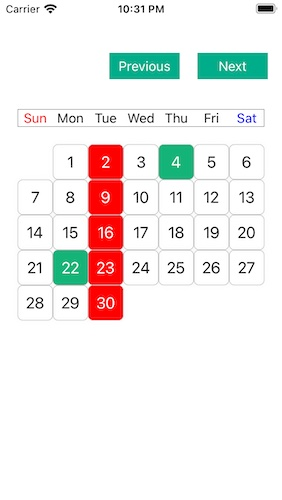
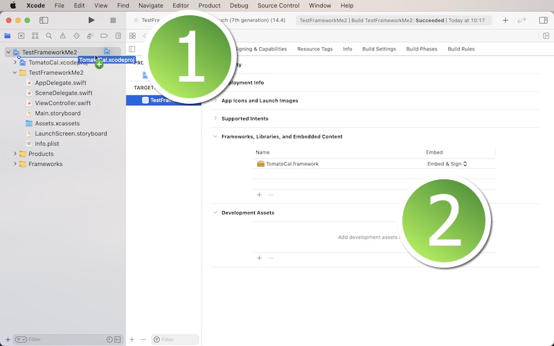

# TomatoCal

TomatoCal (compatible with iOS 11 or greater, tested with an actual device running iOS 13.3.1, simulator running iOS 14.4) is a customizable framework (those Previous and Next buttons in the screenshot above not included) used for iOS devices.  Each cell is a button that the user can tap.  And the framework will return the year, the month, day of the month, day of the week of the selected date all as numbers (Int).  You can change the cell size (Int) between 24 and 60 (inclusive) such that you can create a calendar adjusted for each device size.

In order to use this framework, download the sample project.  You will find the folder titled 'TomatoCal.'  Locate the Xcode file inside.  And put this Xcode file in your Xcode project.  Select your target and make sure you have 'TomatoCal.framework' under General > Framworks, Libraries, and Embeded Content as shown below.

Now that you have the framework in your project, set up TomatoCal in your view controller.  First, instantiate TomatoCal to create an object right under the view controller class name.  In the viewDidLoad method, call tomatoCal's makeCalendar, which will return a UIView object, which you can add to your view controller's view.

This framework comes with two delegate methods.  One is getCalendarNumbers(myYear: Int, myMonth, Int, myDay: Int, myDayOfWeek).  This method will return the calendar date of user's selection when they tap one of calendar day buttons.  The other delegate method will return the initial calendar year and month.  When you set up TomatoCal, you can tell it of the initial year and month with its startYear and startMonth.  Or set its hasCurrentDate to true and let the framework set the current calendar year and month according to the device.  In the latter case, you can get them through the second delegate method.

You have options of starting each week with Sunday or Monday.  The default option is the former.  If you want to start the calendar week with Monday, set mondayFirst to true.

Lastly, it's your job to keep track of the current year and month.  If necessary, create two Int variables like currentYear and currentMonth in your view controller.  If you want to advance the calendar by one month, add 1 to currentMonth and then call TomatoCal's changeDaysOfMonth(myYear:, myMonth:) method.
